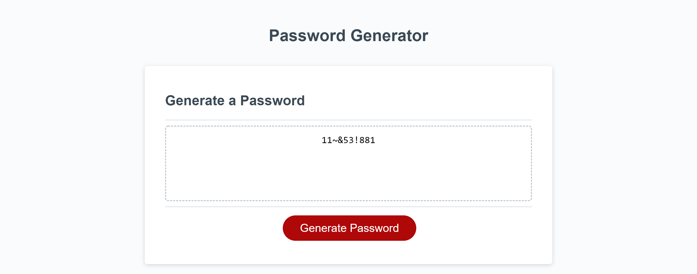

# Javascript-Password-Generator

## About

I wrote the code for the generatePassword function so that a user can specify the length of the password and if they would like their password to contain upper case, lower case, numeric, and/or special characters. Once they specify these items, the generator will produce a random password based on those parameters.

I worked with multiple study groups while working on this project.

## Deployed Site

The deployed site can be found here: [Javascript-Password-Generator](https://hanfernan.github.io/Javascript-Password-Generator/)
